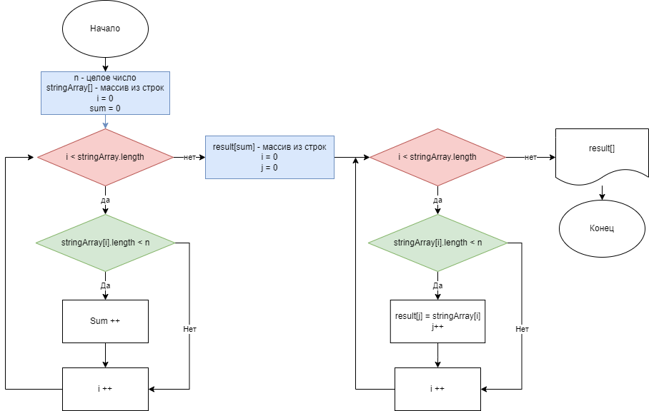

# Задание
Написать программу, которая из имеющегося массива строк формирует массив из строк, длина которых меньше либо равна 3 символа. Первоначальный массив можно ввести с клавиатуры, либо задать на старте выполнения алгоритма. При решении не рекомендуется пользоваться коллекциями, лучше обойтись исключительно массивами. 

## Пример:
1. ["hello","2","world",":-)"] - > ["2",":-)"]
2. ["1234","1567","-2","computer science"] - > ["-2"]
3. ["Russia","Denmark","Kazan"] -> []

## **Порядок решения:**
* при помощи диалогового окна уточняем у пользователя размер массива строк
* создаем массив строк указанного размера
* вводим с клавиатуры элементы массива 
* проверяем сколько элементов массива имеют длину меньше 4 символов
* создаем массив строк для записи результата определенного на предыдущем шаге размера
* проходим по всем элементам массива, записываем в новый массив те элементы, длина которых меньше 4
* выводим на экран результирующий массив строк

## Алгоритм

